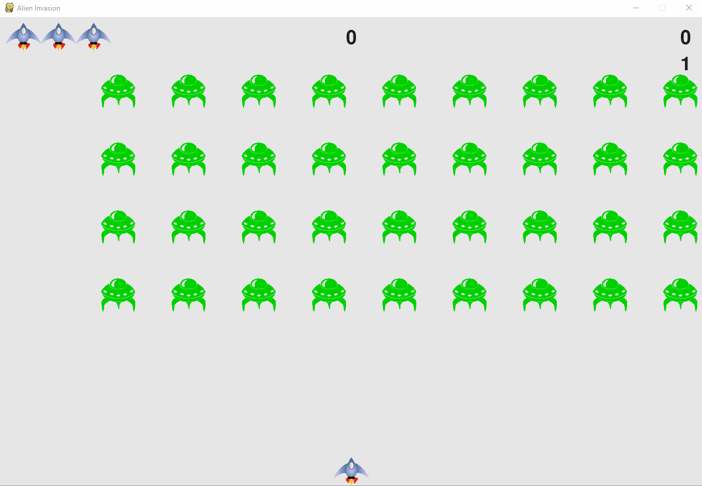

# Space Invaders

Space Invaders ist ein zweidimensionales, Shooter-Spiel, bei dem der Spieler ein Schiff steuert, indem er es horizontal über den unteren Teil des Bildschirms bewegt und auf absteigende Aliens feuert. Ziel ist es, vier Reihen von neun Aliens zu besiegen, die sich horizontal über den Bildschirm hin- und herbewegen, während sie sich zum unteren Rand des Bildschirms bewegen. Der Spieler besiegt ein Alien und erhält dafür Punkte, indem er es mit der Laserkanone abschiesst. Je mehr Aliens besiegt werden, desto schneller werden sowohl die Bewegungen der Aliens.

Die Ausserirdischen versuchen, das Schiff zu zerstören, indem sie auf es schiessen, während sie sich dem unteren Rand des Bildschirms nähern. Wenn sie den Boden erreichen, ist die Invasion der Ausserirdischen erfolgreich und das Spiel endet.



## Requeriments

- [Python](https://www.python.org/)
- [Pygame](https://www.pygame.org/)

## Let's play

### Cloning the Repository

Erstellen Sie zunächst Ihren Fork des Projekts, und klonen Sie dann mit:

```none
git clone https://github.com/YodaCh96/Space-Invaders.git
cd Space-Invaders
```

### Running

Um das Spiel zu starten, müssen Sie sicherstellen, dass Sie Python und die Pygame-Bibliothek in Ihrem System installiert haben. Starten Sie dann das Spiel mit:

```none
python space-invaders.py
```

## Contributing

Jede Idee, um neue Funktionen hinzuzufügen oder die aktuelle zu verbessern, ist willkommen. Forken Sie zunächst das Repository. Dann können Sie jederzeit Pull Requests hinzufügen oder Issues öffnen.

## Feedback

Wenn Sie einen Fehler finden oder einen Vorschlag haben, melden Sie sich. Ich bin für jedes Feedback dankbar und werde mein Bestes tun, um dieses Paket zu verbessern.

## Contact

Vielen Dank, dass Sie sich mein Spiel angesehen haben, und ich hoffe, dass es Ihnen gefällt! Fühlen Sie sich frei, mich zu kontaktieren.

Ioannis Christodoulakis
ioannis.ch@outlook.com
